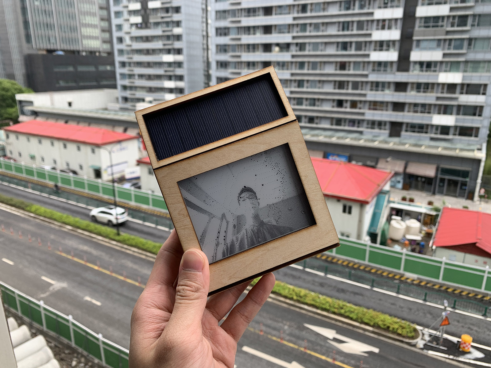

# Solaroid

Final project for 'Energy Spring 2021'

A digital camera designed under the philosophy of Polaroid. It utilized solar power and displays the photo permanently on its e-paper screen.

Learn More: <https://itp.jasongao.me/energy/solaroid>
